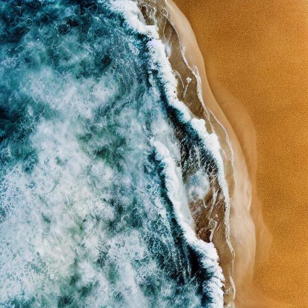
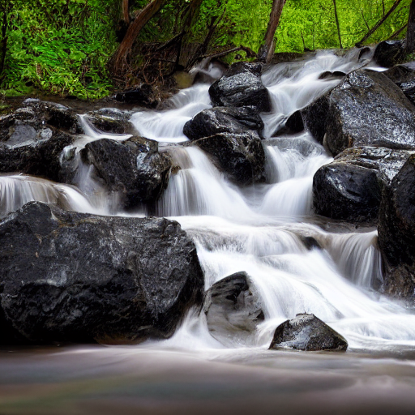

# Implementing Audio-to-Image Generation Based on Diffusion Model

## Project Overview
This project is a deep learning-based system for generating images from audio, aiming to produce images related to the given audio signals.

## Environment Setup
Install libraries: library_installation.ipynb

Download from [BEATs_iter3_plus_AS2M_finetuned_on_AS2M_cpt2.pt](https://huggingface.co/camenduru/beats/blob/main/BEATs_iter3_plus_AS2M_finetuned_on_AS2M_cpt2.pt) to the models/beats folder.

## Dataset Preparation
Download the VGGSound dataset (including vggsound.csv) from [VGGSound](https://huggingface.co/datasets/Loie/VGGSound)，process it: data_prepare.ipynb
 
Generate filter configuration files: filter_files_generate.ipynb

## Training
Train to save audio feature embeddings in output/VGGSound_features.bin: train_VGGSound.ipynb

## Images Generation
Utilize the stable diffusion model [stable-diffusion-v1-4](https://huggingface.co/CompVis/stable-diffusion-v1-4)  for image generation:
generate_images.ipynb

The generated images are shown in output/imgs folder.
<table>
  <tr>
    <td>
      
      
car passing by

    </td>
    <td>
      
      
ocean burbling

    </td>
    <td>
      
      
playing electronic organ

    </td>
  </tr>
</table>
<table>
  <tr>
    <td>
      
      
airplane

    </td>
    <td>
      
      
barn swallow calling

    </td>
    <td>
      
      
waterfall burbling

    </td>
  </tr>
</table>

## Reference Code
[audio-to-image](https://github.com/rishavroy97/audio-to-image/tree/main)

[audio-diffusion](https://github.com/teticio/audio-diffusion)
